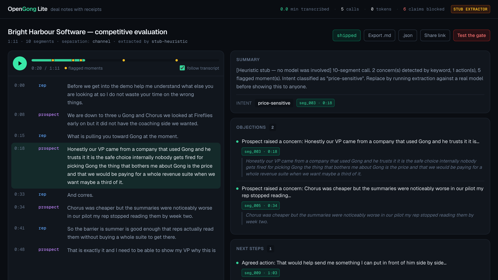

# OpenGong Lite

**Deal notes with receipts.** Upload a sales call, get back a transcript with speaker names, a
summary, objections, intent, next steps and a follow-up email — where every claim points at the
exact line in the call that proves it. Click a claim, hear the moment.



Gong charges around $1,400 a seat. The actual job after a call is three questions: what happened,
what did they push back on, what do I do next. This does that job, in a repo you can clone.

---

## The part that matters

Every notes tool can write you a summary. The problem with all of them is that you cannot tell which
sentences are real. A confident paragraph about "budget concerns" is worthless if nobody can find
where the prospect said it — and worse than worthless if they never did.

So the rule here is **no proof, no claim**:

- Every objection, next step, intent label and follow-up email carries `segment_ids` pointing at
  real transcript lines.
- A **blocking gate** checks every citation before anything reaches you. A claim citing a segment
  that does not exist is **deleted**, and the deletion is logged with a reason.
- A claim whose cited line exists but does not visibly support it ships **flagged**, not quietly
  mixed in with the verified ones.
- The app **shows you what it threw away**. Notes you cannot audit are just a confident guess.

That last one is the whole pitch. Ask any other tool in this category to show you its rejected
claims.

---

## Five-minute setup

**Requires Node 20.9+. Nothing else — no API key, no signup, no database server, no native builds.**

```bash
git clone <this repo> && cd opengong-lite
npm install
npm run dev
```

Open http://localhost:3000. Five fully-analysed sample calls are already there.

That works with a completely empty environment because:

- **five sample calls ship in the repo** — audio, transcripts and notes, all committed;
- **a PyAI sandbox key mints itself** on the first live call (no signup, no card) — with one
  caveat, below;
- storage is Node's built-in SQLite, so there is **nothing to compile and no service to run**.

> **The sandbox-key allowance is per network, and it can run out.** Minting is unauthenticated, so
> PyAI budgets it by network rather than by account: once that budget is spent, every further mint
> from the same network returns `429 sandbox_limit_reached` and the live path stops working until
> you set `PYAI_API_KEY` to an existing key or create an account. We hit this from this machine, and
> we have **not** established whether the limit is per-IP or per-subnet, nor when it resets — the
> error names no reset window. It matters most on shared wifi, where every laptop on the network
> draws from the same budget. The five bundled sample calls are unaffected: they are pre-processed
> and need no key at all (`OPENGONG_STT=fixture` forces that path).

### To analyse your own calls

Transcription needs nothing — the sandbox key handles it. Notes need a model, and the provider is
auto-detected from whatever you have:

```bash
export ANTHROPIC_API_KEY=sk-ant-...          # first-party Anthropic
# ── or Claude on AWS Bedrock ──
export AWS_ACCESS_KEY_ID=...  AWS_SECRET_ACCESS_KEY=...  AWS_REGION=us-east-1
```

With neither set, notes fall back to a keyword stub that is **loudly labelled in the UI** and is not
a substitute for a model. See [Honest caveats](#honest-caveats).

Copy `.env.example` for every option.

---

## How it works

```
audio ──▶ PyAI Hear ──▶ segments ──▶ Claude ──▶ draft ──▶ CITATION GATE ──▶ notes
          (diarized)    seg_000…     (schema-     (untrusted)  drops / flags   + receipts
                                      forced)
```

1. **Transcribe.** `POST /v1/transcription/jobs` with `channel: true` for stereo (exact,
   one-party-per-channel separation) or `diarize: true` for mono. Segment ids are assigned **once**,
   here, and never regenerated or invented by a model.
2. **Extract.** Claude with `output_config.format` forcing a schema, so there is no free-text JSON
   parsing and no parse-and-repair loop anywhere in this codebase.
3. **Gate.** Two tiers — does the citation resolve, and does the segment support the claim. Details
   and the reasoning in [`docs/decisions.md`](docs/decisions.md).
4. **Ship** with a status: `shipped` · `partial` · `failed` · `deadline`. Never nothing.

Swapping any provider is one line in `lib/registry/index.ts`. Nothing outside
`lib/registry/providers/` imports a vendor SDK.

---

## The harness

The wrapper is not the interesting part; anyone can call a transcription endpoint. Seven parts, all
real, all verified by forcing the failure rather than reading the code:

| Part | Where | Proof |
|---|---|---|
| Named loop with one exit status | `lib/harness/loop.ts` | every run ends `shipped`/`partial`/`failed`/`deadline` |
| Blocking gate | `lib/harness/gate.ts` | feed it `seg_999` → claim deleted and logged |
| Bounded aimed retry | `lib/harness/retry.ts` | capped, and the gate's actual complaint goes into the retry prompt |
| Failure invariant | `lib/harness/runlog` + `db.ts` | run row written *before* work; killed processes reconcile to `failed` |
| Capability registry | `lib/registry/` | provider swap is one config line |
| Safe parallelism | `lib/harness/parallel.ts` | different calls concurrent, one call's writes serialised |
| Budget governor | `lib/harness/budget.ts` | token/time/dollar caps checked *before* each call → `deadline` |

```bash
npm run test:gate         # 23 checks — the citation gate blocks, logs, and downgrades status
npm run test:harness      # 39 checks — budgets stop runs, retries bound, no run vanishes
npm run test:readability  # 46 checks — the display layer never changes what was said
npm run check:ship        # the pass/fail ship checklist
npm run verify            # all of the above, in order
```

Try the gate yourself: open any call and press **Test the gate**. It feeds hand-written claims —
some citing segments that do not exist — through the real gate, and shows you what happened.

---

## Honest caveats

Things a demo would normally hide:

- **Transcripts still have no commas or sentence breaks.** PyAI Hear returns lowercase,
  unpunctuated text on both of its models. We store it verbatim (it is the citation source of truth)
  and apply a *deterministic* readability pass for display — casing, acronyms, proper nouns, one
  terminal stop. Inserting commas would need a model, and a model rewriting evidence is the one
  thing this product exists to prevent. So it reads better than raw ASR and still not like prose.
  Markdown export is readable; JSON export is verbatim.
- **One display pass does change words, deliberately, and is fenced in.** Hear ignores `numerals`
  and reads figures out digit by digit, so the flagship sample says "the number is one four oh oh a
  seat". A second pass collapses a run of four or more spoken digits into `1400` — but only if the
  run contains an unambiguous digit word, so a stutter ("oh oh oh that is a problem") and counting
  ("one two three items") are both left alone. Every conversion must round-trip to the same digits
  or it is discarded. Where the two error directions trade off we take the false negative: an
  unconverted "one four oh oh" is ugly and honest, a fabricated "000" is neither. `npm run
  test:readability` asserts across all 50 committed segments that what is rendered says the same
  words *and* the same numbers as the verbatim text the gate reads. **And the seam is shown:** a
  normalised number is underlined and hovering names the spoken words, while the Markdown export
  footnotes every substitution by segment id. You can always tell which figures Hear returned and
  which we rendered.
- **The usage counter reads `0.0 min` on a fresh clone.** Loading a committed sample records no
  usage, because replaying a cached file burns nothing. It moves when you process a call.
- **Speaker roles in mono are a heuristic** — whoever talks first is the rep. Exact for stereo. The
  UI always tells you which mode produced the labels.
- **Sample audio is synthesised**, not real customer calls. No PII in a public repo.
- **No CRM sync, no deal scoring, no forecasting.** This does the after-the-call job and stops.

---

## Scripts

| Command | What it does |
|---|---|
| `npm run dev` | Start the app |
| `npm run samples` | Rebuild the five sample calls (audio + transcripts + notes) |
| `npm run extract:samples` | Re-run notes over existing transcripts — no re-recording, no re-transcribing |
| `npm run test:gate` | Citation gate verification |
| `npm run test:harness` | Harness verification |
| `npm run test:readability` | Proves the display layer never changes what was said |
| `npm run check:ship` | Ship checklist |
| `npm run verify` | All four suites in order — the one command to run before shipping |

## Layout

```
lib/types.ts              the data contract — nothing else defines a segment or a claim
lib/registry/             capability registry + providers (pyai, claude, bedrock, fixtures)
lib/harness/              the seven parts
lib/db.ts                 node:sqlite — no native deps
app/calls/[id]/           the workspace
samples/                  committed transcripts + notes for the zero-setup demo
docs/api-truth.md         every API assumption, verified against the live API
docs/decisions.md         the judgement calls, and why
docs/site/index.html      the full documentation site — open it in a browser
docs/serve.mjs            dependency-free static server for the docs site
DEPLOY.md                 hosting: two services, the Node version pin, what survives a redeploy
```

For anything beyond this README, open `docs/site/index.html`. It covers the same ground in two
registers — plain English first, then the technical detail — and §08 is a built / pending / blocked
matrix that says exactly what is real today.

---

MIT licensed. Runs on [PyAI](https://docs.pyai.com/quickstart) — a sandbox key mints itself, free,
no signup, subject to the per-network allowance noted in [Five-minute setup](#five-minute-setup).
