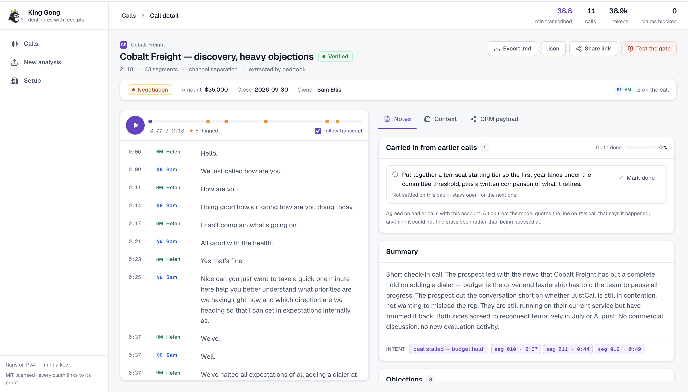

# King Gong

**Deal notes with receipts.** Upload a sales call, get back a transcript with speaker names, a
summary, objections, intent, next steps and a follow-up email — where every claim points at the
exact line in the call that proves it. Click a claim, hear the moment.


Gong charges around $1,400 a seat. The actual job after a call is three questions: what happened,
what did they push back on, what do I do next. This does that job, in a repo you can clone.

---

## The part that matters

Every notes tool can write you a summary. The problem with all of them is that you cannot tell which
sentences are real. A confident paragraph about "budget concerns" is worthless if nobody can find
where the prospect said it — and worse than worthless if they never did.

So the rule here is **no proof, no claim**:

- Every objection, next step, intent label and follow-up email carries `segment_ids` pointing at
  real transcript lines.
- A **blocking gate** checks every citation before anything reaches you. A claim citing a segment
  that does not exist is **deleted**, and the deletion is logged with a reason.
- A claim whose cited line exists but does not visibly support it ships **flagged**, not quietly
  mixed in with the verified ones.
- The app **shows you what it threw away**. Notes you cannot audit are just a confident guess.

That last one is the whole pitch. Ask any other tool in this category to show you its rejected
claims.

---

## Five-minute setup

One command on any Mac. It sorts out Node, clones the repo, installs, asks for your keys, and then
proves the pipeline on a real call before claiming it worked:

```bash
curl -fsSL https://raw.githubusercontent.com/AshmitGupta-slbs/king-gong-hackathon/main/install.sh | bash
```

(`bash <(curl -fsSL …/install.sh)` works too, and keeps your terminal on stdin rather than the pipe.)

Then `cd king-gong` and pick a surface — `npm run dev` for the web app on
http://localhost:3000, or `./kg` for the terminal UI. Full walkthrough in
[`ONBOARDING.md`](ONBOARDING.md).

Already cloned it, or prefer to do it by hand:

```bash
npm ci
./setup.sh          # interactive: keys, checks, and a real end-to-end run
npm run dev
```

Open http://localhost:3000. Five fully-analysed sample calls are already there.

**Requires Node 22.13+** (for the built-in `node:sqlite`, which is why there is no database to install
and nothing to compile). **Nothing else — no API key, no signup, no database server, no native builds,
no Python, no ffmpeg.** Note the floor is 22.13 and not 22.5: `node:sqlite` first appeared in 22.5 but
stayed behind `--experimental-sqlite` until 22.13, so 22.5 through 22.12 pass a naive version check and
then throw `ERR_UNKNOWN_BUILTIN_MODULE` at the first query — measured, not inferred. `engines` and
`.nvmrc` declare it, and `node scripts/node-check.cjs` tests whether Node can *actually* do it rather
than trusting the number.

That works with a completely empty environment because:

- **five sample calls ship in the repo** — audio, transcripts and notes, all committed;
- **a PyAI sandbox key mints itself** on the first live call (no signup, no card) — with one
  caveat, below;
- storage is Node's built-in SQLite, so there is **nothing to compile and no service to run**.

> **The sandbox-key allowance is per network, and it can run out.** Minting is unauthenticated, so
> PyAI budgets it by network rather than by account: once that budget is spent, every further mint
> from the same network returns `429 sandbox_limit_reached` and the live path stops working until
> you set `PYAI_API_KEY` to an existing key or create an account. We hit this from this machine, and
> we have **not** established whether the limit is per-IP or per-subnet, nor when it resets — the
> error names no reset window. It matters most on shared wifi, where every laptop on the network
> draws from the same budget. The five bundled sample calls are unaffected: they are pre-processed
> and need no key at all — `lib/samples.ts` reads committed JSON and never touches the registry, so
> no flag is needed to make the bundled demo work offline.

### To analyse your own calls

Transcription needs nothing — the sandbox key handles it. Notes need a model, and the provider is
auto-detected from whatever you have:

```bash
export ANTHROPIC_API_KEY=sk-ant-...          # first-party Anthropic
# ── or Claude on AWS Bedrock ──
export AWS_ACCESS_KEY_ID=...  AWS_SECRET_ACCESS_KEY=...  AWS_REGION=us-east-1
# AWS_ACCOUNT_ID is optional — derived via STS when blank
```

With neither set, notes fall back to a keyword stub that is **loudly labelled in the UI** and is not
a substitute for a model. See [Honest caveats](#honest-caveats).

**Or bring no model at all, and let PyAI write the notes.** `LLM_PROVIDER=recap` routes the
transcript to [PyAI Recap](https://docs.pyai.com/guides/recap-call-intelligence), which needs only a
`PYAI_API_KEY` carrying `recap:read` on an org with Recap enabled. It is never auto-detected — a PyAI
key exists on every machine that runs this, because one mints itself, and detecting Recap from its
presence would silently move everybody off Claude. Three differences, all shown in the interface:

- Recap **takes no prompt**, so `skills/` and account context are not applied, and it judges none of
  the commitments carried in from earlier calls.
- Recap **returns no citations**. Each claim is matched back to a transcript line here — by Recap's
  own quote where it gave one, otherwise by word overlap. `npm run test:gate` §9 pins down what that
  does and does not prove.
- Because a matched citation always resolves, an unsupported claim ships **visibly flagged on a
  partial run** rather than being deleted.

**A self-minted sandbox key cannot run Recap, and never will.** Sandbox keys carry
`hear:transcribe`, `transcribe:jobs`, `voice:synthesize`, `omni:session`, `amd:*` and `cast:render` — read
off a minted key, not inferred — and no `recap:*` at all. So the free key transcribes your calls perfectly
well and cannot write the notes. The engine picker greys Recap out when it sees a sandbox key, and a run
that asks for it anyway fails **before** transcribing, so no minutes are spent finding out.

`npx tsx scripts/probe/recap-probe.ts` checks the key and prints exactly what Recap returns.

To choose explicitly rather than auto-detect, set `LLM_PROVIDER` (`anthropic_bedrock` · `anthropic` ·
`recap` · `stub`). An unrecognised value **fails loudly** rather than falling back, so a typo cannot
quietly turn into stub notes that look like model output. The **Notes engine** picker on the home page
overrides it for a single upload without changing the default — which is how you run one call through
both engines and compare.

`LLM_MODEL` accepts any of the four shapes Bedrock understands, each handled differently
(`lib/bedrock-model-id.ts`) — getting this wrong yields a 404 that reads like a region problem:

| Value | Sent as |
|---|---|
| *unset* | `global.anthropic.claude-sonnet-4-6` — a cross-region inference profile that works with nothing else configured |
| `3s3wyt6beb2x` — a bare **application inference profile id** (a team's cost-attribution handle) | expanded to `arn:aws:bedrock:{region}:{account}:application-inference-profile/{id}`. The account comes from `AWS_ACCOUNT_ID`, or from `sts:GetCallerIdentity` if that is blank |
| `arn:aws:bedrock:…` | verbatim |
| `global.anthropic.claude-sonnet-4-6` — cross-region profile | verbatim |
| `claude-opus-5` — foundation id | routed through a cross-region profile: `global.anthropic.claude-opus-5` |

**Both `LLM_MODEL` and `AWS_ACCOUNT_ID` are optional.** The default is already an inference profile,
which matters because an account without provisioned throughput cannot invoke a *foundation* model
on-demand at all — Bedrock returns *"Invocation of model ID … with on-demand throughput isn't
supported. Retry with the ID or ARN of an inference profile"*. And when a bare profile id does need an
account, it is derived once via `sts:GetCallerIdentity`, which requires no IAM permission of its own.

`npm run check:model` prints `input → resolved` for each candidate and reports which your account
actually accepts — worth running before blaming credentials for a 404.

Copy `.env.example` for every option.

---

## How it works

```
                                     Claude ─────┐
audio ──▶ PyAI Hear ──▶ segments ──▶ (schema-    ├──▶ draft ──▶ CITATION GATE ──▶ notes
          (diarized)    seg_000…      forced)    │   (untrusted)  drops / flags   + receipts
                                     PyAI Recap ─┘
                                     (cited here,
                                      not by it)
```

1. **Transcribe.** `POST /v1/transcription/jobs` with `channel: true` for stereo (exact,
   one-party-per-channel separation) or `diarize: true` for mono. Segment ids are assigned **once**,
   here, and never regenerated or invented by a model.
2. **Extract.** Claude with `output_config.format` forcing a schema, so there is no free-text JSON
   parsing and no parse-and-repair loop anywhere in this codebase. Or PyAI Recap, which writes the
   notes itself and returns no citations — those are resolved against the transcript here, by Recap's
   own quote where it gave one and by word overlap otherwise, and the gate then rules on them exactly
   as it rules on a model's.
3. **Gate.** Two tiers — does the citation resolve, and does the segment support the claim. Details
   and the reasoning in [`docs/decisions.md`](docs/decisions.md).
4. **Ship** with a status: `shipped` · `partial` · `failed` · `deadline`. Never nothing.

Swapping any provider is one line in `lib/registry/index.ts`. Nothing outside
`lib/registry/providers/` imports a vendor SDK.

**Skills** shape step 2. What counts as a real objection, when a commitment is verifiable, how to
judge whether last call's promise happened — that judgement lives in `skills/<id>/SKILL.md`, in
markdown a salesperson can edit, not in a string literal. Files may say what to *look for*; they may
not supply wording to *describe* findings in, because the gate scores a claim against the line it
cites and borrowed vocabulary makes true claims fail. `npm run test:skills` enforces it.

**Action items** span steps 4 and 1 of the *next* call. A verified next step becomes a commitment
that stays open until something settles it; the next call with that account is asked about each one
by id and must cite a line to close it. Silence closes nothing. The percentage always ships with its
denominator, and a commitment closed by a person rather than by evidence says so.

**CRM payload.** `GET /api/calls/{id}/crm-payload` returns exactly what a HubSpot push would post,
every claim linking back to the moment that proves it. It cannot be sent — see the caveats.

---

## The harness

The wrapper is not the interesting part; anyone can call a transcription endpoint. Seven parts, all
real, all verified by forcing the failure rather than reading the code:

| Part | Where | Proof |
|---|---|---|
| Named loop with one exit status | `lib/harness/loop.ts` | every run ends `shipped`/`partial`/`failed`/`deadline` |
| Blocking gate | `lib/harness/gate.ts` | feed it `seg_999` → claim deleted and logged |
| Bounded aimed retry | `lib/harness/retry.ts` | capped, and the gate's actual complaint goes into the retry prompt |
| Failure invariant | `lib/harness/loop.ts` + `lib/db.ts` | run row written *before* work; killed processes reconcile to `failed` |
| Capability registry | `lib/registry/` | provider swap is one config line |
| Safe parallelism | `lib/harness/parallel.ts` | different calls concurrent, one call's writes serialised |
| Budget governor | `lib/harness/budget.ts` | token/time/dollar caps checked *before* each call → `deadline` |

```bash
npm run test:gate         # 37 checks — the citation gate blocks, logs, and downgrades status
npm run test:harness      # 127 checks — budgets stop runs, retries bound, no run vanishes, audio inspected
npm run test:skills       # 42 checks — skills load, select, and do not poison the gate
npm run test:readability  # 46 checks — the display layer never changes what was said
npm run check:ship        # the 27-item pass/fail ship checklist
npm run verify            # all of the above, in order — 252 checks plus the checklist

npm run test:store        # 66 checks — the storage contract. NOT in verify: it needs a backend
```

Try the gate yourself: open any call and press **Test the gate**. It feeds hand-written claims —
some citing segments that do not exist — through the real gate, and shows you what happened.

---

## Honest caveats

Things a demo would normally hide:

- **Transcripts still have no commas or sentence breaks.** PyAI Hear returns lowercase,
  unpunctuated text on both of its models. We store it verbatim (it is the citation source of truth)
  and apply a *deterministic* readability pass for display — casing, acronyms, proper nouns, one
  terminal stop. Inserting commas would need a model, and a model rewriting evidence is the one
  thing this product exists to prevent. So it reads better than raw ASR and still not like prose.
  Markdown export is readable; JSON export is verbatim.
- **One display pass does change words, deliberately, and is fenced in.** Hear's digit rendering is
  unreliable and not controllable from the request — the flagship sample comes back as "the number is
  one four oh oh a seat", and setting `numerals: true` does not change it (tested across three
  formats, and against the committed bytes). It is deterministic per file; the flag just is not the
  variable, so the fix has to be deterministic on our side.
  A second pass collapses a run of four or more spoken digits into `1400` — but only if the
  run contains an unambiguous digit word, so a stutter ("oh oh oh that is a problem") and counting
  ("one two three items") are both left alone. Every conversion must round-trip to the same digits
  or it is discarded. Where the two error directions trade off we take the false negative: an
  unconverted "one four oh oh" is ugly and honest, a fabricated "000" is neither. `npm run
  test:readability` asserts across all 50 committed segments that what is rendered says the same
  words *and* the same numbers as the verbatim text the gate reads. **And the seam is shown:** a
  normalised number is underlined and hovering names the spoken words, while the Markdown export
  footnotes every substitution by segment id. You can always tell which figures Hear returned and
  which we rendered.
- **The usage counter reads `0.0 min` on a fresh clone.** Loading a committed sample records no
  usage, because replaying a cached file burns nothing. It moves when you process a call.
- **Speaker roles in mono are a heuristic** — whoever talks first is the rep. Exact for stereo. The
  UI always tells you which mode produced the labels.
- **Sample audio is synthesised**, not real customer calls. No PII in a public repo.
- **The bundled sample notes were written by hand, not by a model.** Their citations are real and
  were resolved by the real gate, but no model wrote the prose — `extracted_by` reads
  `demo-fixture` and the app says so wherever they appear. `npm run verify` therefore has one red
  line on a clean clone, deliberately. `npm run extract:samples` with a model credential clears it.
- **A commitment can be closed by a person, not just by evidence.** The model may only mark a prior
  action item done by quoting a line from a later call; a human may do it with no citation at all.
  Both are recorded, and the UI shows which — a tick with a quote behind it and a tick that says a
  person did it are different claims, and the follow-through percentage mixes them.
- **Skills change the notes.** Anything under `skills/` is loaded into the extraction prompt, so
  editing a `SKILL.md` — or pointing `OPENGONG_SKILLS_DIR` at a different corpus — changes what the
  model looks for. "What actually ran" on the home page lists which skills were live.
- **`LLM_PROVIDER=recap` is a weaker product than the Claude path, and is labelled as one.** Recap
  takes no prompt, so no playbook and no account context reaches it, and `skills_used` is recorded as
  empty rather than as the corpus that was merely loaded. It judges no carried commitments, so a
  Recap call never auto-closes an earlier action item — a person still can. And because its citations
  are matched here rather than asserted by it, the gate's *delete* path is unreachable: an unsupported
  Recap claim ships flagged on a partial run instead of being removed. The call header, the notes
  panel and "What actually ran" all say which engine produced what.
- **Recap's own numbers are not all trustworthy, and we do not show the ones we cannot check.**
  Its `moments[].offset_s` is a floored utterance start, so the obvious timestamp lookup lands on the
  previous segment and attributes the quote to the wrong speaker — measured 0/6 correct, versus 6/6
  for nearest-start. Its `analytics.filler_rate` and `question_count` were `0` on every call probed.
  Details in [`docs/api-truth.md`](docs/api-truth.md).
- **MongoDB makes records durable, not audio.** With `MONGODB_URI` set the call, transcript and
  notes survive a redeploy; the uploaded WAV is a filesystem object and needs a mounted volume. See
  `DEPLOY.md`.
- **No CRM sync, no deal scoring, no forecasting.** This does the after-the-call job and stops. It
  will show you the exact payload a HubSpot push would post — every claim carrying a link back to
  the line that proves it — but it cannot send it. There is no client and no credential, and
  `check:ship` fails if either appears.

---

## Scripts

| Command | What it does |
|---|---|
| `npm run dev` | Start the app |
| `npm run samples` | Rebuild the five sample calls (audio + transcripts + notes) |
| `npm run extract:samples` | Re-run notes over existing transcripts — no re-recording, no re-transcribing. Refuses without a real model rather than overwriting the committed notes with stub output |
| `npm run test:gate` | Citation gate verification |
| `npm run test:harness` | Harness verification |
| `npm run test:skills` | Skill corpus loads, selects, and does not poison the gate |
| `npm run test:store` | Storage contract, against whichever backend is configured |
| `npm run test:readability` | Proves the display layer never changes what was said |
| `npm run check:ship` | Ship checklist |
| `npm run check:key` | Is the PyAI key live, and what scopes does it carry |
| `npm run check:model` | Prints `input → resolved` per model id, and which your account accepts |
| `npx tsx scripts/probe/recap-probe.ts` | Is Recap reachable, and what does its `record` actually contain |
| `npm run check:store` | Which storage backend is active, and does a round trip actually work |
| `npm run check:licenses` | Audits every dependency's license against MIT distribution — see [`THIRD_PARTY_LICENSES.md`](THIRD_PARTY_LICENSES.md) |
| `npm run fixtures` | Rebuild the hand-authored demo notes (never labelled as model output) |
| `npm run reindex:samples` | Rebuild `samples/index.json` from what is on disk |
| `npm run lint` · `npm run build` · `npm start` | The usual Next.js three |
| `npm run start:docs` | Serve `docs/site/` on :8099 — dependency-free |
| `npm run verify` | All five suites in order — the one command to run before shipping |

## Layout

```
lib/types.ts              the data contract — nothing else defines a segment or a claim
lib/registry/             capability registry + providers (pyai hear, claude, bedrock, recap, fixtures)
lib/harness/              the seven parts
lib/db.ts                 the storage dispatcher — SQLite by default, Mongo if MONGODB_URI is set
lib/db-sqlite.ts          node:sqlite — no native deps, no server
lib/db-mongo.ts           the same contract over MongoDB
lib/store/                backend selection, and a REST shim for gateway-only clusters
lib/skills.ts             loads skills/ into the extraction prompt
lib/action-items.ts       commitments carried from the call that made them to the one that settles them
lib/crm/payload.ts        what a HubSpot push would post. Pure — there is no client and no credential
skills/<id>/SKILL.md      the judgement, in markdown you can edit without touching TypeScript
app/(app)/calls/[id]/     the workspace
samples/                  committed transcripts + notes for the zero-setup demo (audio: public/samples/)
docs/api-truth.md         every API assumption, verified against the live API
docs/decisions.md         the judgement calls, and why
docs/site/index.html      the full documentation site — open it in a browser
docs/serve.mjs            dependency-free static server for the docs site
DEPLOY.md                 hosting: two services, the Node version pin, what survives a redeploy
```

For anything beyond this README, open `docs/site/index.html`. It covers the same ground in two
registers — plain English first, then the technical detail — and §08 is a built / pending / blocked
matrix that says exactly what is real today.

---

## License

[MIT](LICENSE) — the code in this repository, no restrictions. That's a claim about this
project's own code; it says nothing on its own about the ~640 npm packages it depends on, each
carrying its own license. [`THIRD_PARTY_LICENSES.md`](THIRD_PARTY_LICENSES.md) is the audit that
closes that gap — every license actually present in the installed dependency tree, checked
against MIT distribution, reproducible with `npm run check:licenses`. Short version: nothing in
the tree conflicts with MIT, so nothing needed to change to make this claim true — the audit is
there so you don't have to take that on faith.

Runs on [PyAI](https://docs.pyai.com/quickstart) — a sandbox key mints itself, free, no signup,
subject to the per-network allowance noted in [Five-minute setup](#five-minute-setup).

---


